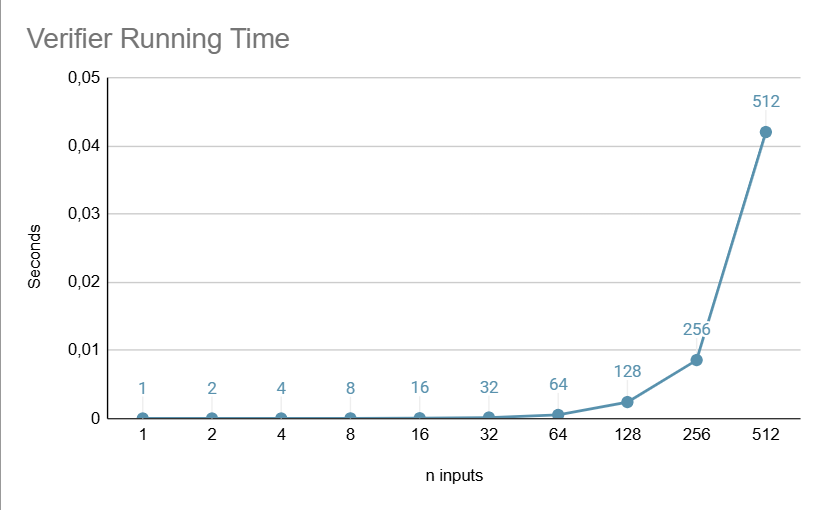
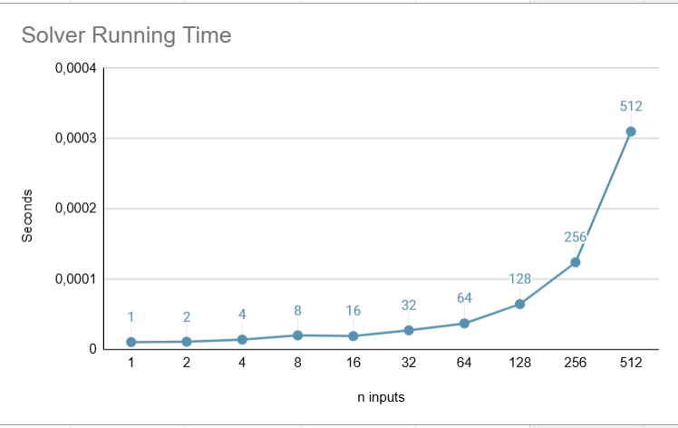

# Gale-Shapley-algorithm-implementation by Sherif Abdou (74195059) & Luis A Navia (67904582)
Implementation of the Gale Shapley algorithm to match students with Hospitals on a stable manner, 
this implementation will also have a verifier that checks whether said proposed matching is valid and stable.
For this algorithm we will be working under the assumption that the number of Hospitals and the number of un Students are the same, 
so that the matrix is of n^2 instead of n*m. The input is expected to be of three parts,
first the number of hospitals and students (n), followed by the Hospitals preference list and lastly
the students preference list. This algorithm will run until n pairs are made that is when the verifier
will run and output one of three things, "VALID STABLE" meaning all the pairs are valid and stable, 
"INVALID", "UNSTABLE" or "INVALID AND UNSTABLE" depending on the case, we will be using the observations
provided in class by Prof. Boucher to determine whether the output is Valid, Unvalid or unstable.

# INSTRUCTIONS TO RUN PROJECT
The only dependency for this project is python 3.10+

To run this project it is needed to run it terminal, the comands needed are 

TO SOLVE
  -> `python src/main.py solve [input file] -o [name of file to output to] [-t]`

Example:
`python src/main.py solve examples/input.in -o examples/output.out`
  
TO VERIFY
   ->  `python src/main.py verify [input file] [solver output file] [-t]`

`python src/main.py verify examples/input.in examples/output.out`

`-t` is an optional argument to print the time taken for the solver or verifier algorithm respectively.

# Verifier Graph

A trend noticed in this graph is that the execution time increases more and more as the number of hospitals/students scale.

# Solver Graph

A similar trend noticed in this graph is that the execution time increases more and more as the number of hospitals/students scale.
